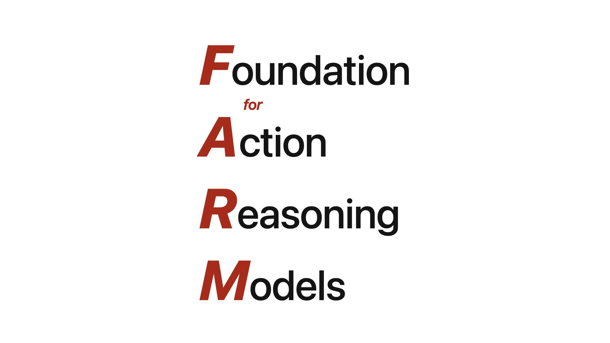
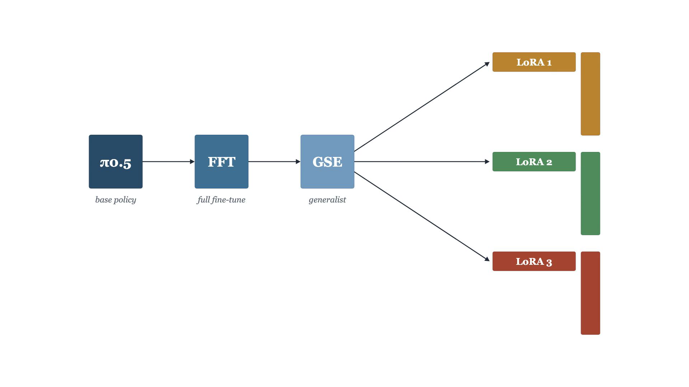
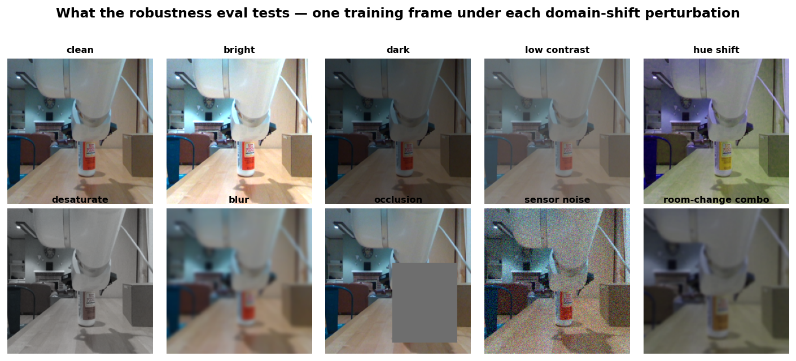
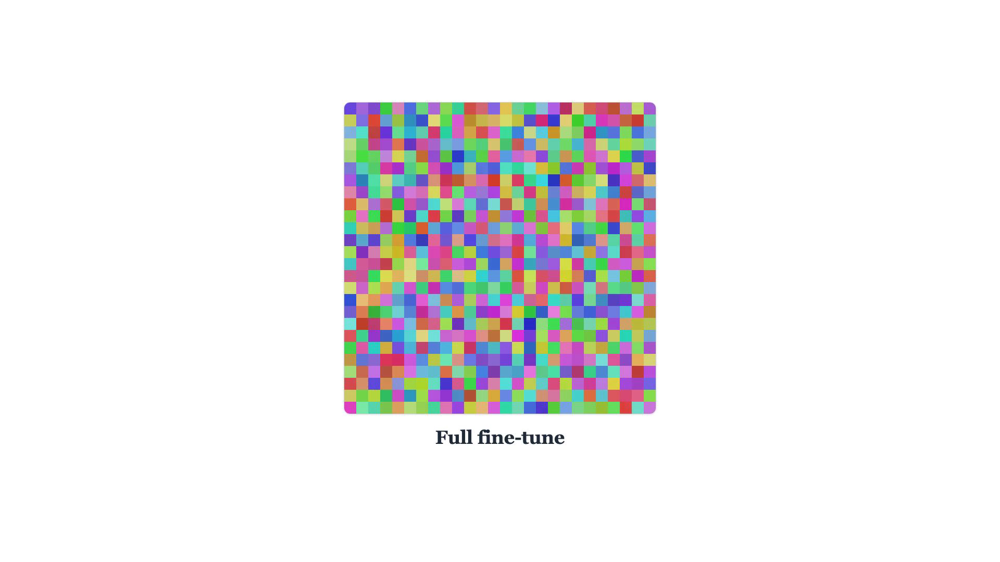
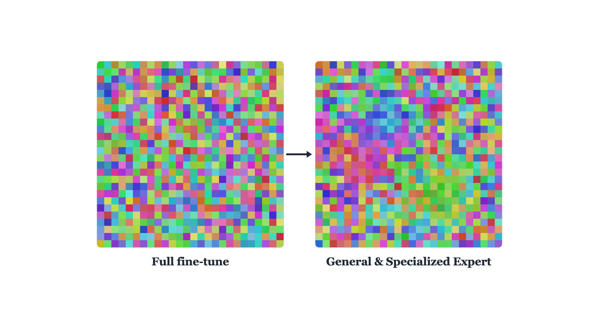
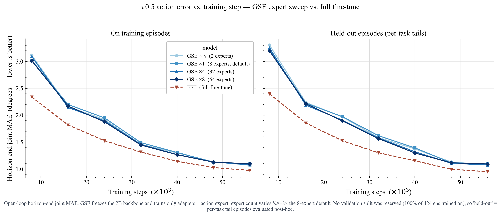
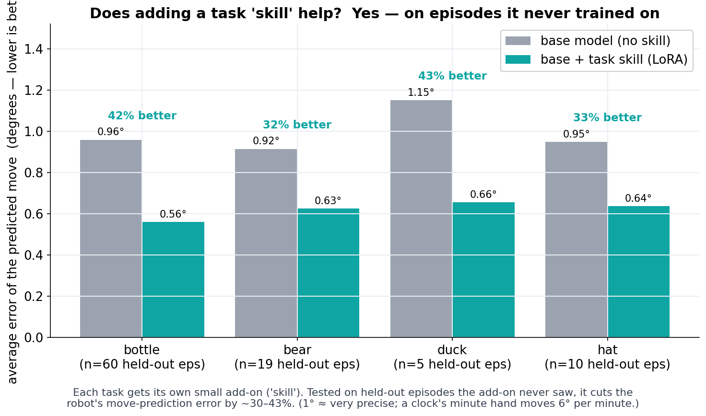
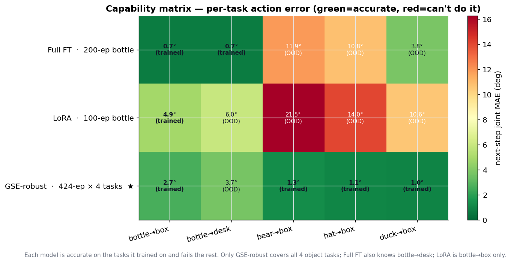
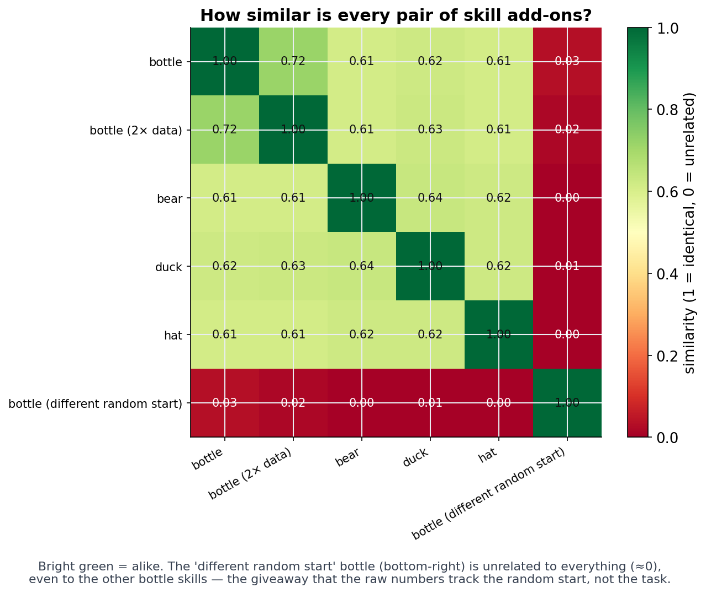

<div align="center">



# FARM

**Foundation Action-Reasoning Models.** An architecture that wraps vision-language-action policies
in a stack of tiny, swappable skill adapters so a single robot arm can do real, repeatable factory
work.

[](https://www.ufactory.cc/)
[](https://www.physicalintelligence.company/)
[]()
[]()
[]()
[](https://claude.com/claude-code)

*Megabyte-sized skill files, about 1% the parameters of the model they adapt, that average a*
***37% improvement on episodes outside the training set.***

</div>

---

> **FARM is a full pipeline:** VR-teleoperate a UFactory UF850 to record demonstrations →
> export to a LeRobot dataset → fine-tune Physical Intelligence's **π0.5** on an H100 cluster →
> layer on efficient skill adapters → serve the policy back to the arm. In two months I'm taking
> it to **Dongguan, China** to automate line work at a toy factory.

<div align="center">


*The three-layer skill stack: a full fine-tune of π0.5, a GSE generalist/specialist pass, and per-job LoRA skills.*
</div>

## Contents

- [Why FARM](#why-farm)
- [Hardware and data](#hardware-and-data)
- [The three-layer architecture](#the-three-layer-architecture)
  - [Layer 1: base policy](#layer-1-base-policy)
  - [Layer 2: GSE experts](#layer-2-gse-experts)
  - [Layer 3: task LoRA skills](#layer-3-task-lora-skills)
- [The skill system](#the-skill-system)
- [The task system](#the-task-system)
- [What works](#what-works)
- [Open question: do skills share structure?](#open-question-do-skills-share-structure)
- [Early experiments: Rubik's cube and chess](#early-experiments-rubiks-cube-and-chess)
- [Repository layout](#repository-layout)
- [Quickstart](#quickstart)
- [Training a policy](#training-a-policy)
- [Reference](#reference)
- [Roadmap](#roadmap)
- [AI assistance](#ai-assistance)
- [Acknowledgements](#acknowledgements)

## Why FARM

This project came out of a trip I took to factories in China. A huge amount of that labor, the
low-volume, high-touch line work in toy and consumer-goods factories, could and *should* be
automated, but it isn't. Vision-language-action (VLA) models are incredible pieces of technology,
yet their applications in these factories are badly underutilized. People overlook these
"undesirable" use cases because they aren't as visible as automotive or deep tech, but this is
exactly the space that offers the largest benefit to the day-to-day people otherwise doing these
jobs for dollars a day.

I believe VLAs are currently bottlenecked by two solvable problems:

1. **Data.** Solved by actually being deployed in factories.
2. **Consistency.** Solvable with more work on architectures like this one.

FARM is my attempt at the consistency half: a way to take a broadly-capable base policy and make
it *reliably* good at the specific, repeated jobs a factory line actually runs, without storing a
massive separate model for every task.

## Hardware and data

To collect data and test the models I purchased a **UFactory UF850**, a 6-DoF arm with a parallel
gripper, and gave it sight through **two Intel RealSense cameras** (a base view and a wrist view)
on **custom 3D-printed mounts**. A clean MuJoCo sim stands in when no hardware is attached, so the
whole stack runs on a laptop.

I also **[open-sourced the VR teleop stack](https://github.com/NoahWeiss123/weiss-open-teleop)**: a Unity
app for the Meta Quest 3 that lets you drive the arm, trigger recordings, and see its live status
through passthrough. Controller poses stream to the
daemon over a ROS-TCP bridge; the loop looks like this:

```
   Quest 3 (VR)  →  farm serve · record  →  LeRobot dataset  →  fine-tune π0.5 + skills  →  serve to UF850 arm
```

The demonstrations become LeRobot datasets on the HuggingFace Hub:

| Dataset | Episodes | Tasks | Frames |
|---|---|---|---|
| [`NoahWeiss/farm_uf850_multiobject`](https://huggingface.co/datasets/NoahWeiss/farm_uf850_multiobject) | 424 | 4 (bottle · bear · hat · duck) | ~129k @ 30 fps |
| [`NoahWeiss/farm_uf850_bottle`](https://huggingface.co/datasets/NoahWeiss/farm_uf850_bottle) | 200 | 2 | 59,183 @ 30 fps |
| `NoahWeiss/farm_bottle_lora` | 100 | 1 (bottle subset) | ~26k |

## The three-layer architecture

FARM is built on three layers. Each one is cheaper than the last, and the cheapest one is the one
you ship per job.

### Layer 1: base policy

The first layer is the **base fine-tuned policy**. I start from Physical Intelligence's **π0.5**
(a ~3.3B-parameter VLA: a PaliGemma vision-language tower plus an action expert) and run a *one-time*
**full fine-tune** on a diverse selection of actions to adapt the model to the arm.

Before each frame is fed into training, I apply a stack of **randomized perturbations** (brightness,
contrast, hue, saturation, blur, occlusion, sensor noise, and full room and lighting shifts) to
harden the policy against the gap between where you collect data and where you deploy.

<div align="center">


*Every training frame is seen under randomized domain shift, so the policy doesn't memorize one room's lighting.*
</div>

The flagship base checkpoint is **`farm_uf850_multiobject_fft_robust`** (step 55,999), trained on
the 424-episode, 4-task multiobject dataset.

<div align="center">


*A full fine-tune moves **every** parameter: maximum capacity, but the whole model is in play.*
</div>

### Layer 2: GSE experts

The next layer is an additional fine-tune using **GSE** (Generalized and Specialized Experts), a
method recently out of Tsinghua. It creates two kinds of internal expert at the same time: a **generalist**
that learns what's common across every task, and **specialists** that each get good at a narrow
subset of motions. This pass tweaks only **~2.5% of the parameters**, making it highly efficient.
The result is a model that's broadly competent while exercising high precision on the
factory-specific tasks it sees most.

<div align="center">


*GSE freezes the backbone and trains a small generalist + specialist set of experts (teal + violet).*
</div>

A useful finding fell out of the expert sweep: **expert count is almost a non-knob.** Going from
**2 experts to 64** roughly *doubled* training time but bought essentially no accuracy. The curves
sit on top of each other, which let me tune very fast training runs without paying for capacity I
didn't need.

<div align="center">


*2, 8, 32, and 64 experts: nearly identical held-out error. The big-capacity runs don't pull ahead.*
</div>

### Layer 3: task LoRA skills

The third layer is what makes FARM deployable on a factory floor, where repeatability and accuracy
matter most. For any specific repeated job I train a **LoRA**: a tiny rank-16 adapter that encodes
**one skill** and adds onto the frozen FFT-GSE base. About **30 demonstrations** are enough to train
one.

Each skill is only a few megabytes, so they live locally on the line and stack onto one shared base
instead of a fleet of multi-gigabyte models. On held-out episodes the adapter never saw, a skill
cuts the arm's move-prediction error by **~37% on average**. On tasks already in the FFT-GSE
training data, it can roughly **double the accuracy**.

<div align="center">


*Each task gets its own megabyte-sized skill. Tested on episodes the skill never trained on, error drops 30 to 43%.*
</div>

## The skill system

<div align="center">


*One skill is about **1%** of the base model's parameters: a few megabytes you can keep on the factory floor.*
</div>

The payoff of Layer 3 is operational, not just numerical. A skill is ~1% of the model's parameters
and a few megabytes on disk, so:

- **Skills stack on one base.** Every job a line runs becomes a small file that snaps onto the same
  shared FFT-GSE model, with no per-task fleet of multi-gigabyte checkpoints.
- **They're hot-swappable.** The serving stack can load and swap an adapter at a known step without
  reloading the base, so a single served policy can become a different specialist on demand.
- **They compound.** The more jobs a factory runs, the bigger the local skill library gets, and the
  cheaper each *new* job is to add.

## The task system

To make this genuinely useful in a factory, FARM wraps the policy in an **agentic task system**.
You specify a task in plain language. In one demo, all I said was *"place the items on the box."*
From that prompt the agentic layer:

1. **Captures an image** to understand the setup.
2. **Identifies and maps** the position of each object in the scene.
3. **Searches its skill library** for adapters that match those objects.
4. **Decides the best order** to pick the objects up.
5. **Builds a plan** with a verification check after each action, confirming the step completed
   before moving on.

This planning only needs to happen **once per workflow**. FARM **saves the plan**, so if you're
running a multi-week line you can re-run the same job without paying for the expensive planning
inference every time.

## What works

Across architectures, the honest headline is that **the best method is data-dependent.** On the
4-task multiobject data, the GSE-robust base is the all-rounder: it's the only model accurate
across *every* object task, while a full fine-tune or a single LoRA is a tight specialist that
fails outside its training distribution.

<div align="center">


*Green = accurate, red = can't do it. Only GSE-robust (★) covers all four object tasks; specialists nail their lane and fail the rest, which is exactly why per-job skills matter.*
</div>

The deployed policy is served from **`NoahWeiss/farm_uf850_pi05_gse_robust`** with server-side
Real-Time Chunking for smooth motion. The full benchmark, ablations, and training audits live in the
project's analysis reports.

## Open question: do skills share structure?

There's one technical thread I find fascinating but couldn't finish in time: **do the skill
adapters contain embeddings that generalize to the *kind* of task they perform?** For example, do
all plush pick-and-place skills share a structure, or all box-opening skills? If they do, you could
**compose new tasks from shared structure** instead of collecting data and training from scratch
each time, massively cutting the data burden of deploying to a new line.

The first result is a cautionary one: **raw LoRA weights track the random seed, not the task.** Two
skills trained on the *same* task with different seeds are nearly orthogonal (cosine ≈ 0.0), while
different tasks at the same seed all cluster around ~0.6. So a skills library has to index by
**behavior**, not by raw weight similarity, which is what makes this an open and interesting
problem rather than a solved one.

<div align="center">


*The "different random start" bottle skill (bottom-right) is unrelated to everything, even the other bottle skills. Raw weights encode the seed, not the task.*
</div>

## Early experiments: Rubik's cube and chess

After getting the arm, one of my first goals was to test the spatial-reasoning limits of modern
LLMs. I gave it a **Rubik's cube**, handing it only preset functions (*rotate top face*, *orient
the front face up*, and a setpoint where the top face is visible to the camera). With just a
harness, the LLM devised its own methodology: scan each face, write a solver, and map the solver's
output moves onto motions it could actually execute.

In another project it played **chess**, again given only well-defined functions (the pickup function
for each square and how to capture a piece), and it wired up two Stockfish engines to play each
other on the physical board.

These experiments showed me that **LLM *planning* was already good enough** for fairly complex
tasks, but the models couldn't *execute* the fine movements themselves. That's what pushed me toward
VLA models, and ultimately toward FARM.

## Repository layout

```
farm/
├── teleop/            Data collection: drive the arm + record demos
│   ├── edge-agent/      the daemon (farm serve): MuJoCo sim + xArm backend,
│   │                    HTTP/SSE server, ROS-TCP bridge, recorder, episode review, CLI
│   └── quest/           Meta Quest 3 VR client (Unity), publishes controller poses
├── ui/                Browser dashboard + episode-review app (single-file HTML)
├── model/             The policy: dataset export, training, eval, serving
│   ├── export_lerobot.py, analyze_dataset.py, eval_pi05.py, …
│   ├── cluster/         H100 fine-tuning: full-FT, GSE, LoRA configs + serve/hot-swap
│   └── cloud/           optional Modal-hosted policy server
├── shared/            Shared error catalog (farm_shared)
└── datasets/          Recordings + LeRobot exports (gitignored, on the HF Hub)
```

## Quickstart

Run the daemon (needs Python 3.12):

```bash
python3 -m venv .venv && source .venv/bin/activate
pip install -e ./shared            # the shared error catalog
pip install -e ./teleop/edge-agent # the daemon (pulls farm_shared, mujoco, aiohttp…)
pip install mujoco                 # sim backend

farm serve            # daemon + dashboard + ROS-TCP bridge; opens the browser
```

Open **http://127.0.0.1:8787/** for live camera tiles (base + wrist), joint bars, a TCP/RPY readout,
cartesian jog buttons, the recorder, and a policy-eval panel. **`/review`** is the
episode-review + clip app for curating recordings. The Quest teleop bridge listens on **`:10000`**
(ROS-TCP wire format).

## Training a policy

1. **Record** demos with `farm serve` + the Quest client; curate them in `/review`.
2. **Export** to a LeRobot dataset and push to the Hub:
   ```bash
   python model/export_lerobot.py --src datasets/dataset3 --out datasets/lerobot/farm_uf850_bottle
   python model/analyze_dataset.py        # audit alignment, smoothness, gripper, tasks
   ```
3. **Fine-tune** π0.5 with one of three interchangeable architectures:

   | Config | Method | Idea |
   |---|---|---|
   | `pi05_farm_uf850` | full fine-tune | max capacity; the FARM base layer |
   | `pi05_farm_uf850_gse` | **GSE** | SVD spectral generalized + specialized experts (~2.5% params) |
   | `pi05_farm_uf850_lora` | **LoRA** | rank-16 per-job skills that add onto the FFT-GSE base |

   See **[`model/cluster/README.md`](model/cluster/README.md)** and **[`model/README.md`](model/README.md)** for the runbook and how the three compare.
4. **Serve + evaluate**: a serve job runs the policy server (with hot-swappable skill adapters);
   `python model/eval_pi05.py` reads observations from `farm serve` and drives the arm.

## Reference

<details>
<summary><b>Common commands</b></summary>

```bash
farm serve                       # daemon + dashboard + ROS-TCP bridge
farm config init                 # scaffold ~/.farm/config.yaml
pytest teleop/edge-agent/tests   # daemon tests (deterministic, no GPU)
pytest shared/tests              # shared-catalog tests
ruff check .                     # lint
```
</details>

<details>
<summary><b>HTTP API (selected)</b></summary>

```text
GET  /                          dashboard          GET  /review               episode-review app
GET  /v1/world  /v1/world/stream  snapshot + SSE   GET  /v1/cameras/{base,wrist}.jpg
POST /v1/teleop/jog|home|gripper|joints            POST /v1/teleop/estop[/clear]
POST /v1/policy/run|stop · prompt · heartbeat      GET  /v1/episodes …          record + review
```
</details>

<details>
<summary><b>ROS-TCP bridge</b></summary>

Listens on TCP `:10000`, speaking the `Unity.Robotics.ROSTCPConnector` wire format (4-byte topic
length + UTF-8 topic + 4-byte body length + body). It accepts `/q2r_*` Quest publishers and pumps
`/joint_states` outbound at 10 Hz. See `teleop/edge-agent/src/farm_edge_agent/ros_bridge/` for the
topic schemas.
</details>

## Roadmap

- **Dongguan, China (July).** Take FARM to a toy factory and automate real line work, which also
  attacks the data bottleneck directly.
- **Consistency.** Keep pushing the architecture on the second VLA bottleneck: reliable, repeatable
  execution under real-world shift.
- **Composable skills.** Pursue the open question above: find behavioral structure shared across
  skills so new jobs can be *composed* instead of trained from scratch.

## AI assistance

I used AI coding tools, mainly [Claude Code](https://claude.com/claude-code), to help write and
refactor parts of the software and the analysis scripts. The research, experiments, and hardware
work are my own.

## Acknowledgements

- **[Physical Intelligence](https://www.physicalintelligence.company/)**: the π0.5 base policy and the [openpi](https://github.com/Physical-Intelligence/openpi) training stack.
- **[VLA-GSE](https://arxiv.org/abs/2605.06175)** (Jiang et al., Tsinghua): the Generalized and Specialized Experts method behind Layer 2.
- **[UFactory](https://www.ufactory.cc/)** (UF850), **Intel RealSense**, **Meta Quest 3**, **[LeRobot](https://github.com/huggingface/lerobot)**, and **[Remotion](https://www.remotion.dev/)** (the explainer animations these figures are stills from).

---

<div align="center">
<sub>FARM · Noah Weiss · Stanford CS153 final project · 2026</sub>
</div>
