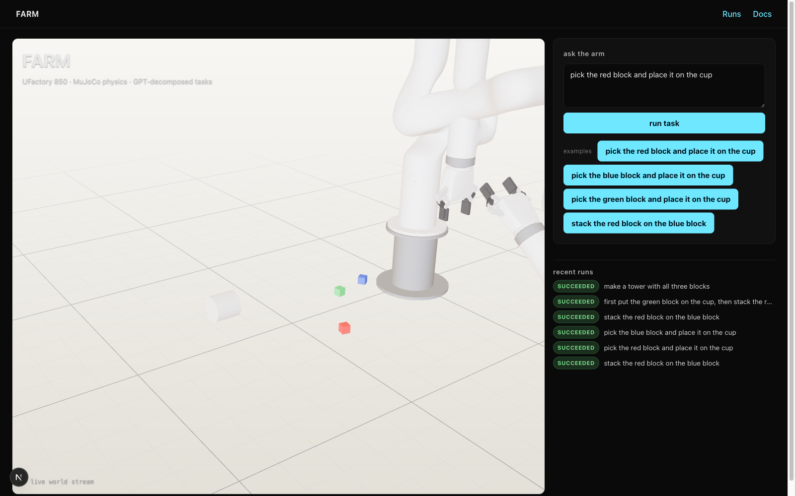

# FARM

**Foundation for Action-Reasoning Models** — a self-improving robotics agent
that decomposes natural-language goals, reasons about its environment, and
turns each successful run into a reusable skill. The control loop runs
locally on the Edge Agent next to a UFactory 850 6-DOF arm (or its MuJoCo
twin); the dashboard, planner, and skill library run as a Cloudflare
worker + Pages app — or, as in this build, against a local Python daemon
that exposes the same shape.

CS153 final project.

---

## End-to-end demo (5 minutes, no hardware)

You need: Python 3.12, [bun](https://bun.sh), an OpenAI API key. Cloudflare
credentials are **not** required — everything runs locally first.

```bash
# 1. clone + venv
git clone <this repo> && cd CS153
python3 -m venv .venv && source .venv/bin/activate
pip install -e ./farm-shared -e ./farm-edge-agent
pip install mujoco openai opencv-python-headless aiohttp aiohttp-cors pillow

# 2. drop your OpenAI key into .env
cp .env.example .env
$EDITOR .env   # set OPENAI_API_KEY=sk-...

# 3. boot the edge daemon (sim + planner + run record + SSE)
export $(grep -E '^[A-Z_]+=' .env | xargs)
farm serve --port 8787 &

# 4. boot the dashboard
bun --cwd farm-cloud/ui install
NEXT_PUBLIC_FARM_API=http://127.0.0.1:8787 bun --cwd farm-cloud/ui run dev
```

Open `http://localhost:3000`, type a task, watch the simulated UF850 do it
in 3D. Try:

- `pick the red block and place it on the cup`
- `stack the blue block on top of the green block`
- `pick the green block and place it on the cup, then stack the red block on the blue block`

Each run produces a JSONL record under `~/.farm/runs/<run_id>/`. Click
into any run from the **Runs** page to replay the event timeline with the
arm position, action chunks, and safety events synchronized to the same
3D viewer.



---

## What's in here

### `farm-edge-agent/` — local control loop (Python)

| Module | Role |
|---|---|
| `drivers.sim.SimDriver` | **MuJoCo 3.8** (Google DeepMind) backed UFactory 850 driver. Loads the real UF850 + xArm Gripper URDF/MJCF from UFactory's `xarm_ros2` description package — joint ranges (J1±360°, J2±132°, J3 -242°/+3.5°, J4±360°, J5±124°, J6±360°), max joint speed (180°/s), joint torques (200/200/90/68/19/19 N·m), and 850 mm reach all match the UFactory 850 datasheet exactly. Two-stage axis-only IK with mid-range nullspace, Cartesian-path tracking with real-time pacing, soft-grasp constraint when fingers close on a prop within reach. |
| `safety` | Workspace envelope, velocity cap, watchdog, e-stop, singularity, calibration. Composed into `SafetyEnforcer` — every action chunk passes through it before reaching the driver. |
| `recovery.primitives` | `home`, `open_gripper`, `relocalize`, `retry_grasp`, `abort_safely`. Invoked when the safety enforcer fires. |
| `run_loop.RunLoop` | Orchestrates a single run: prompt → planner → safety gate → driver → JSONL record. Emits every event to a live sink (the SSE pump). |
| `skills.library` | Skill catalog (`pick_and_place`, `stack`, `go_to`, `home`) + the dispatching `SkillExecutor`. Each skill is a function that maps args + live world state to an action-chunk sequence. |
| `skills.gpt_planner` | OpenAI Chat Completions decomposer. Reads the live scene + skill catalog, emits a JSON plan with named skill calls. Layer-1 plan cache (SQLite under `~/.farm/plan_cache.db`) skips the LLM on repeat prompts. |
| `server` | aiohttp daemon (`farm serve`) — REST + SSE the dashboard talks to. |
| `run_record` | Append-only JSONL with strict Pydantic schemas. Replayable from disk. |
| `assets/urdf/uf850/` | UFactory 850 URDF + MJCF + STL meshes — pulled from UFactory's official `xarm_ros2` repo. Includes the real xArm Gripper (base + 4-bar finger linkage with mimic joints) and a 205 mm robot mount pedestal. |

### `farm-cloud/worker/` — planner gateway (Cloudflare Worker, TypeScript)

- `planner.ts` — `/v1/plans` endpoint. Calls OpenAI Chat Completions through the same shape the edge daemon uses, so swapping to a hosted gateway is a config change.
- `dispatcher.ts` — Durable Object that will own per-run WS state when the cloud deploy lands.
- `router/` — capability-card resolver + fallback chain.

### `farm-cloud/ui/` — dashboard (Next.js 15, Tailwind 4)

- `app/page.tsx` — landing: task input, live 3D viewer, recent runs.
- `app/runs/[id]/page.tsx` — run detail: 3D viewer + live timeline subscribed to SSE.
- `components/arm-viewer.tsx` — react-three-fiber + urdf-loader. Loads `/urdf/uf850/uf850.urdf` from `public/`, applies joint state from the world stream every frame.
- `lib/api.ts` — typed client for the daemon's REST + SSE.

### `farm-shared/` — cross-package contracts (Python)

Schemas, error catalog, protocol versions. Both Python edge-agent and TS worker stay in sync via this package.

---

## Architecture (current build, local mode)

```
┌──────────────────────────────────────────────────────────────────────┐
│  Browser (Next.js dashboard at :3000)                               │
│                                                                      │
│   ┌─────────────────┐    ┌─────────────────┐                        │
│   │ ArmViewer        │    │ Task input +    │                        │
│   │ urdf-loader      │←SSE│ run timeline    │                        │
│   │ joint stream     │    │ POST /v1/runs   │                        │
│   └────────┬────────┘    └────────┬────────┘                        │
│            │                       │                                  │
└────────────┼───────────────────────┼─────────────────────────────────┘
             │  HTTP + SSE           │
             ▼                       ▼
┌──────────────────────────────────────────────────────────────────────┐
│  farm-edge-agent  (Python aiohttp daemon at :8787)                  │
│                                                                      │
│   /v1/scene  /v1/world  /v1/world/stream                            │
│   /v1/runs  /v1/runs/:id  /v1/runs/:id/events                       │
│                                                                      │
│   ┌────────────────┐   ┌────────────────┐   ┌─────────────────────┐ │
│   │ RunSupervisor  │──▶│ RunLoop         │──▶│ SafetyEnforcer     │ │
│   │ (FIFO queue)   │   │                 │   │ envelope, vel,     │ │
│   │                │   │ ┌─────────────┐ │   │ singularity, ...   │ │
│   │                │   │ │ GptPlanner  │ │   └──────────┬─────────┘ │
│   │                │   │ │ (cache hits)│ │              │           │
│   │                │   │ └─────────────┘ │              ▼           │
│   │                │   │ ┌─────────────┐ │   ┌─────────────────────┐│
│   │                │   │ │ SkillExec   │ │──▶│ SimDriver (MuJoCo) ││
│   │                │   │ │ pick/stack/ │ │   │ UF850 + parallel    ││
│   │                │   │ │ go_to/home  │ │   │ jaw, soft-grasp,    ││
│   │                │   │ └─────────────┘ │   │ realtime pacing     ││
│   │                │   └──────┬──────────┘   └──────────┬──────────┘│
│   │                │          │                          │           │
│   │                │          ▼                          ▼           │
│   │                │   RunRecordWriter             EventBus          │
│   │                │   ~/.farm/runs/<id>/          (SSE fanout)      │
│   │                │   record.jsonl                                  │
│   └────────────────┘                                                 │
└──────────────────────────────────────────────────────────────────────┘
                │ (when cloud is configured)
                ▼
┌──────────────────────────────────────────────────────────────────────┐
│  Cloudflare (deferred — see DEPLOY.md)                              │
│  Workers (planner gateway) · D1 (skill metadata) · R2 (artifacts)   │
└──────────────────────────────────────────────────────────────────────┘
```

### How a run flows

1. User submits a task on the dashboard.
2. `POST /v1/runs` → supervisor enqueues a `_PendingRun`.
3. The worker thread pops it. A fresh `RunLoop` is constructed with the singleton `SimDriver`, the planner, the executor, and the safety enforcer.
4. `RunLoop.run()` writes `run_started` to the JSONL record and pushes it to the SSE bus.
5. `GptPlanner.plan()` checks the on-disk cache. On hit it returns immediately; on miss it calls OpenAI with the scene + skill catalog and parses the JSON response into a `Plan`.
6. For each plan node, the `SkillExecutor` dispatches by skill name. The skill emits a list of action chunks (TCP waypoints + gripper commands + critic notes).
7. Each chunk passes through `SafetyEnforcer.check_chunk` (envelope, velocity, singularity). Approved chunks reach `SimDriver.move_to` or `set_gripper`. MuJoCo steps the physics; on each settle step the driver fires `joint_state` events through the EventBus.
8. The supervisor's world-pump thread also publishes a `world_snapshot` every 200 ms so a UI client that just connected sees the arm in real time.
9. After the last node, `run_completed` is written. The badge on the run-detail page flips from "running" to "succeeded" (or "failed" / "aborted_safety").

---

## Commands

### Backend

```bash
farm serve                 # boot the local daemon on :8787
farm doctor                # sanity checks (drivers, calibration, env vars)
farm version               # print versions

pytest farm-edge-agent/tests   # 244 tests
pytest farm-shared/tests        #  21 tests
ruff check .
```

### Frontend

```bash
bun --cwd farm-cloud/ui run dev      # dev server (:3000)
bun --cwd farm-cloud/ui run build    # production build
bun --cwd farm-cloud/ui run test     # vitest
bun --cwd farm-cloud/ui run lint     # tsc --noEmit
```

### Worker

```bash
bun --cwd farm-cloud/worker run dev      # wrangler dev
bun --cwd farm-cloud/worker run test     # vitest, 51 tests
bun --cwd farm-cloud/worker run lint     # tsc --noEmit
bun --cwd farm-cloud/worker run deploy   # requires Cloudflare creds
```

---

## How to add a new skill

Skills are Python functions registered into `farm_edge_agent.skills.library`. To add a `sort_by_color` skill that sorts every block of a given color into a bin:

```python
# in farm_edge_agent/skills/library.py
def _sort_by_color(ctx: SkillContext, args: dict[str, Any]) -> list[dict[str, Any]]:
    color = str(args["color"]).lower()
    target = str(args["bin"])
    bin_pos = ctx.world_props[target]
    chunks: list[dict[str, Any]] = []
    for prop_id, pos in ctx.world_props.items():
        # ... match `color` against prop name or rgba ...
        if color in prop_id:
            chunks.extend(_approach_sequence((prop_id, pos), _meters_to_mm(bin_pos)))
    return chunks

register(SkillSpec(
    name="sort_by_color",
    description="Move every prop whose color matches `color` into `bin`.",
    parameters={"color": "string", "bin": "string"},
    fn=_sort_by_color,
))
```

The planner sees the new entry in its catalog on next call and can produce
plans that reference it. No deploy, no config — just restart `farm serve`.

---

## Migrating to Cloudflare

See [DEPLOY.md](DEPLOY.md). The short version: paste your tokens into
`.env` and `.dev.vars`, run `wrangler deploy`, point
`NEXT_PUBLIC_FARM_API` at the worker URL.

---

## What's not in this build

- **Real arm.** The system runs against MuJoCo. The `drivers.xarm.XarmDriver` is shimmed; `farm doctor real-arm` is a stub. Adding real-arm support requires C1 (SDK shim verification), camera calibration, and the safety envelope being measured against actual workspace geometry.
- **GPT-4o vision perception.** Object positions come from the sim's ground-truth state, not from RGB cameras. The Affordance Reasoner is replaced by the static skill catalog. The full perception stack (M2/M4/M5) is gated on real cameras.
- **Layer-3 LoRA skill compiler.** Plan cache (Layer 1) is live; parameterized code (Layer 2) is implicit in the skill library; the LoRA fine-tune pipeline is a future Modal job.
- **Multi-tenant auth / billing / observability.** Not in scope for the CS153 demo.

See `IMPLEMENTATION_PLAN.md` for the full status grid; the deferred items are explicitly marked.
